# 🏡 NovaNest Interiors

A premium, fully responsive interior design and architecture website built for luxury interior designers, architecture studios, home renovation firms, and modern design consultants. Developed with Next.js, TypeScript, Tailwind CSS, and Framer Motion, the website showcases elegant residential and commercial projects, design services, consultation booking, and a sophisticated editorial-inspired UI.

🔗 **Live Demo:** https://novanest-interiors1.vercel.app

---

# 📖 About the Project

NovaNest Interiors was designed to help premium interior design studios establish a refined digital presence while allowing potential clients to explore luxury projects, professional services, experienced designers, and consultation options.

Visitors can browse completed projects, understand the design process, discover available services, meet the creative team, schedule consultations, and contact the studio through a modern responsive interface.

This project was built to strengthen my frontend development skills by focusing on reusable React components, responsive layouts, accessibility, smooth animations, elegant UI design, and production-ready web development practices.

---

# ✨ Features

### 🏡 Premium Landing Page

- Luxury hero section
- Editorial-inspired layout
- Elegant typography
- Animated call-to-action
- Smooth scroll animations

### 🏠 Project Showcase

- Residential interiors
- Luxury villas
- Modern apartments
- Commercial spaces
- Project galleries
- Interactive layouts

### 👨‍🎨 About Studio

- Company story
- Design philosophy
- Mission & Vision
- Studio achievements
- Creative approach

### 🛋 Interior Design Services

- Interior Design
- Architecture
- Space Planning
- Renovation
- Furniture Design
- Turnkey Solutions

### ⭐ Why Choose NovaNest

- Award-winning designers
- Premium materials
- Personalized designs
- Timely project delivery
- Creative excellence
- Transparent process

### 📐 Design Process

- Consultation
- Planning
- Concept Development
- Design Execution
- Final Delivery

### 👥 Expert Team

- Interior Designers
- Architects
- Project Managers
- Creative Specialists

### 📅 Consultation Booking

- Online consultation form
- Project inquiry
- Budget discussion
- Appointment scheduling

### 📞 Contact

- Contact form
- Google Maps
- Studio location
- Business hours

### 🎨 User Experience

- Fully responsive layout
- Mobile-first design
- Sticky navigation
- Smooth animations
- Premium editorial UI
- Loading animation

---

# 🛠 Tech Stack

## Frontend

- Next.js
- React
- TypeScript
- Tailwind CSS

## UI & Animations

- Framer Motion
- Lucide React

## Deployment

- Vercel

---

# 📸 Screenshots

### 🏠 Home & About

| Home | About |
|------|-------|
| 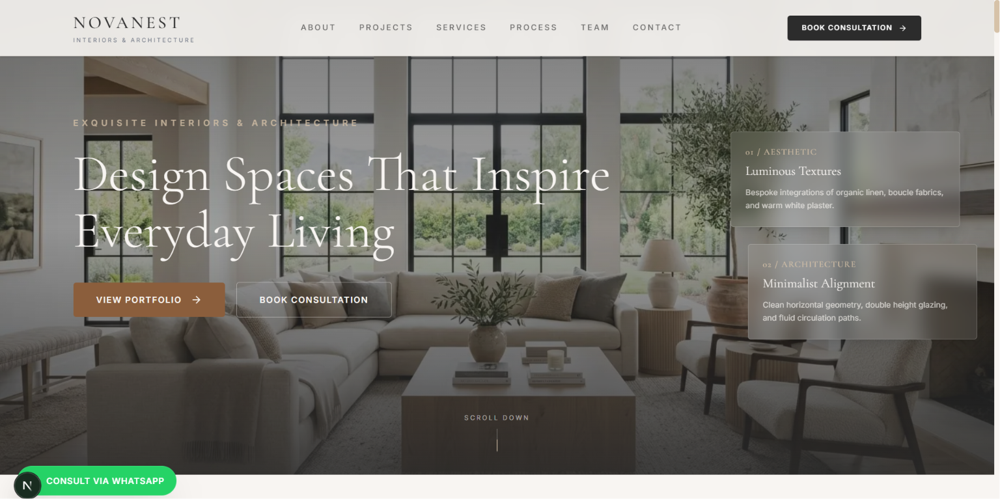 | 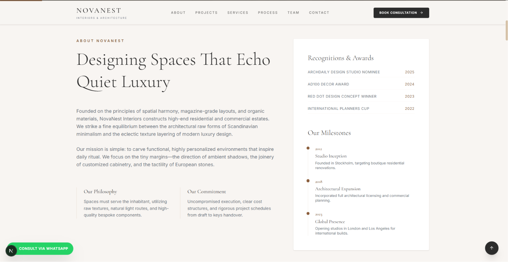 |

---

### 🏡 Featured Projects

| Project Showcase 1 | Project Showcase 2 |
|-------------------|--------------------|
| 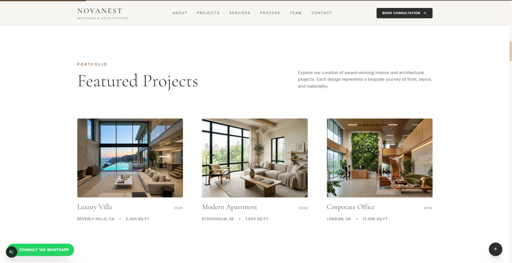 | 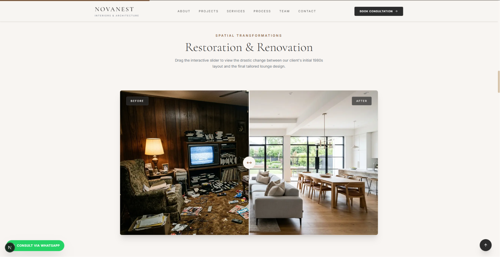 |

---

### 🛋 Services & Why Choose Us

| Services | Why Choose Us |
|----------|---------------|
| 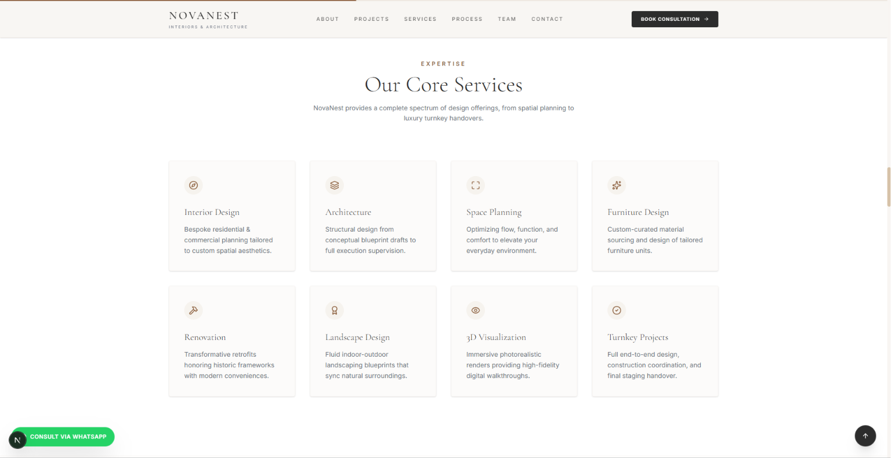 | 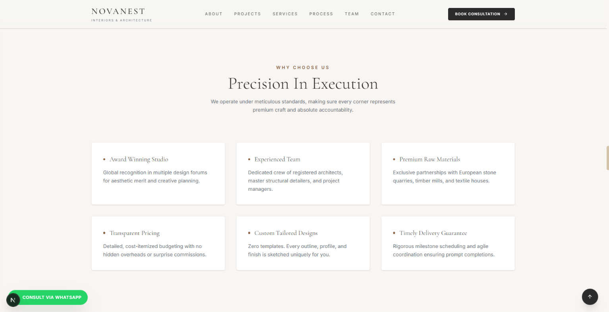 |

---

### 📐 Design Process & Team

| Design Process | Team |
|---------------|------|
| 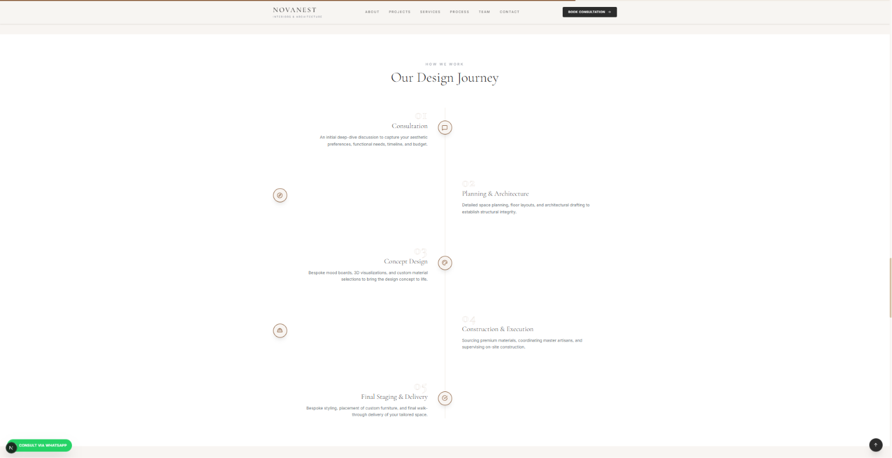 | 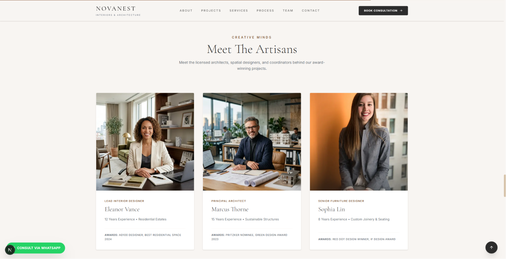 |

---

### 📅 Book Consultation & Contact

| Book Consultation | Contact |
|-------------------|---------|
| 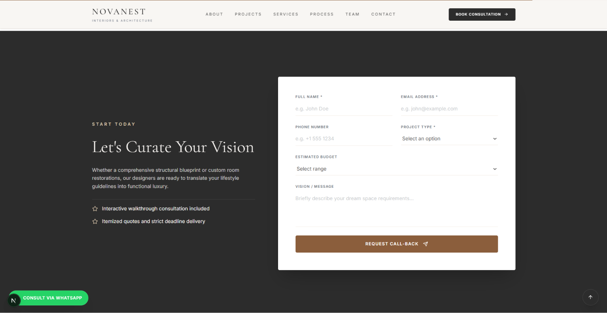 | 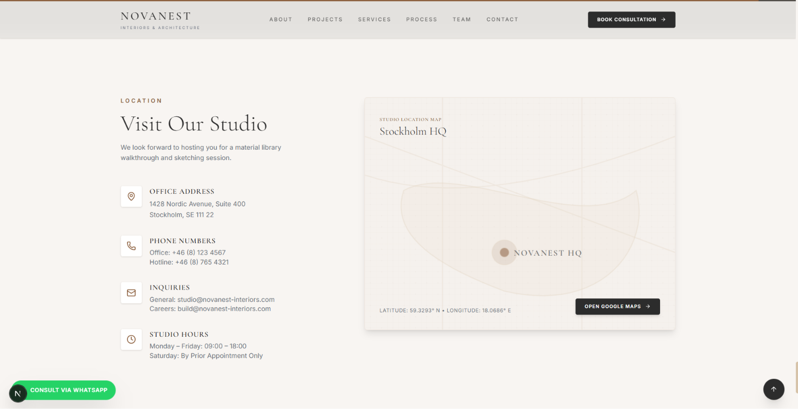 |

---

### 📱 Mobile Preview

<p align="center">
  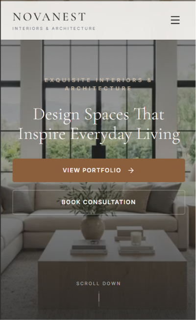
</p>

---

# 📂 Project Structure

```text
novanest-interiors
│
├── public
│   ├── images
│   └── icons
│
├── src
│   ├── app
│   ├── components
│   │   ├── common
│   │   ├── sections
│   │   └── ui
│   ├── hooks
│   └── utils
│
├── screenshots
│
└── README.md
```

---

# ⚙️ Installation

## Clone the repository

```bash
git clone https://github.com/Pulipati-Rahul/novanest-interiors.git
```

## Navigate into the project

```bash
cd novanest-interiors
```

## Install dependencies

```bash
npm install
```

---

# ▶️ Running the Project

```bash
npm run dev
```

Runs on:

```text
http://localhost:3000
```

---

# 🌍 Live Deployment

https://novanest-interiors1.vercel.app

---

# 💡 What I Learned

While building this project, I learned:

- Building premium interior design websites
- Editorial-style UI design
- Modern Next.js architecture
- Responsive layouts
- Component-based development
- Framer Motion animations
- Tailwind CSS best practices
- Mobile-first development
- Accessibility improvements
- Deployment using Vercel

---

# 🚀 Future Improvements

- Before & After comparison slider
- Interactive 3D room showcase
- Project filtering
- Virtual consultation booking
- Design inspiration blog
- CMS integration
- Client dashboard
- AI room visualization
- Multi-language support
- Online quotation system

---

# 👨‍💻 Author

**Pulipati Rahul**

Full Stack Developer

GitHub:  
https://github.com/Pulipati-Rahul

LinkedIn:  
https://www.linkedin.com/in/pulipatirahul

Portfolio:  
https://pulipatirahul.vercel.app

---

# ⭐ Support

If you found this project helpful, consider giving it a ⭐ on GitHub.

It motivates me to continue building high-quality projects.
